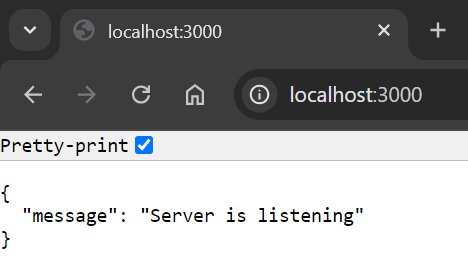

# Project Assessment
Module 6: Datacentric Development \
Submitted by: Tan Chee Meng (Sam Tan) \
Date: 09-Oct-2024 \
GitHub link: https://github.com/SamTan20240527/DatacentricDevelopment

# Introduction
A souvenirs distributor needs a sales order system to keep track of products and sales orders
- item: item_number, description, country_of_origin, price
- sales_order: orderId, item_number, order_quantity, delivery_date

# RESTful API testing on Thunder Client in VS Code
## Test server

## Testing

