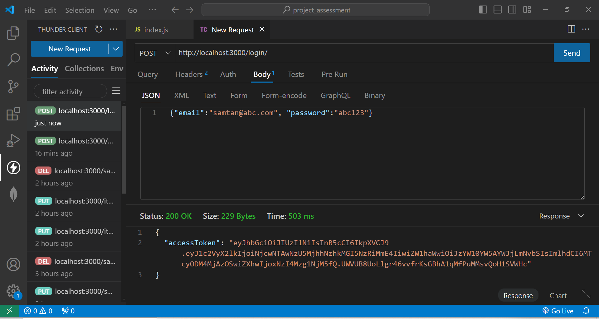

# Project Assessment
Module 6: Datacentric Development \
Submitted by: Tan Chee Meng (Sam Tan) \
Date: 09-Oct-2024 \
GitHub link: https://github.com/SamTan20240527/DatacentricDevelopment/

# Introduction
A souvenirs distributor needs a sales order system to keep track of products and sales orders
- Database: sales_order_app
  - Primary collection: item
    - Document fields: item_number, description, country_of_origin, price 
  - Secondary collection: sales_order
    - Document fields: _id, item_number, order_quantity, delivery_date \
    (Other data such as customer, address, etc. are skipped to reduce data-entry during testing)
  - Relationship: <sales_order.item_number> is the foreign key to <item.item_number>

# RESTful API testing in VS Code extension Thunder Client
## Test server: http://localhost:3000/

## POST users: {"email":"samtan@abc.com", "password":"abc123"}

## POST login to get token: {"email":"samtan@abc.com", "password":"abc123"}

## GET profile by pasting the token at Auth-Bearer: http://localhost:3000/profile/

## GET item: http://localhost:3000/item/

## POST item: http://localhost:3000/item/

## GET sales_order: http://localhost:3000/sales_order/<_id>

## POST sales order: http://localhost:3000/sales_order/

## PUT sales_order: http://localhost:3000/sales_order/<_id>

## DELETE sales order: http://localhost:3000/sales_order/<_id>

-end-

